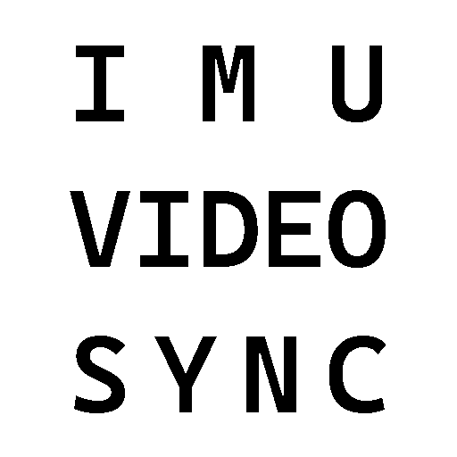

# Software

  <article class="software-card">
    

      

        

          
        

        

          <h3>IMU Video Sync</h3>
          

            Automatically align data telemetry logs with on-track video to produce accurate offsets for data overlays.
          

        

      

    

    

      <a class="github-button" href="https://github.com/brandonstrohmeyer/imu_video_sync">
        
        View on GitHub
      </a>
    

  </article>

  <article class="software-card">
    

      

        

          
        

        

          <h3>LiveGrid</h3>
          

            A better way to consume spreadsheet trackday schedules. Provides upcoming session push notifications, run group filtering, and more.
          

        

      

    

    

      <a class="github-button" href="https://github.com/brandonstrohmeyer/livegrid">
        
        View on GitHub
      </a>
    

  </article>

